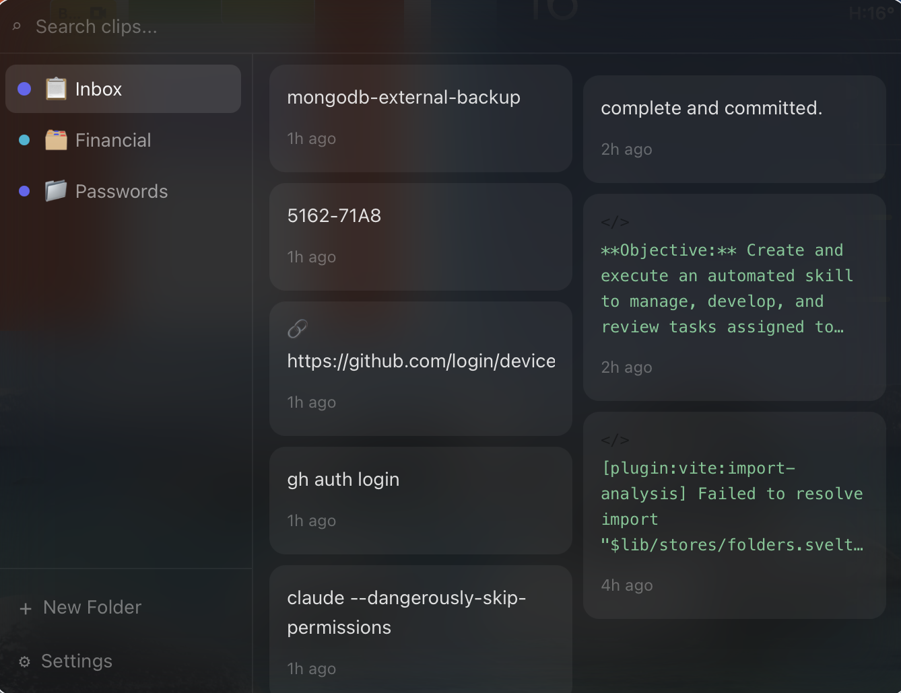

<div align="center">


<br/><br/>

**A blazing-fast, macOS-native clipboard manager that lives in your menu bar and gets out of your way.**

<br/>

[](https://github.com/nokhodian/mono-clip)
[](https://tauri.app)
[](https://svelte.dev)
[](https://www.rust-lang.org)
[](LICENSE)
[](https://github.com/nokhodian/mono-clip/stargazers)

<br/><br/>



<br/><br/>

</div>

---

## ✨ Why MonoClip?

You know that feeling when you copy something important, then copy something else, and the first thing is **gone forever**? Yeah. That ends today.

MonoClip sits quietly in your menu bar, **remembers everything you copy**, and lets you retrieve any past clip in under a second. No subscriptions. No cloud. No nonsense. Just your clipboard, supercharged.

<br/>

## 🚀 Features

<table>
<tr>
<td width="50%">

### 📁 Smart Folders
Create custom folders for anything — *Code Snippets*, *Email Templates*, *Links*, *Passwords*. Your clips, your structure.

### ⌨️ Global Shortcut Routing
Assign a hotkey to any folder. Press it and whatever you have selected (or in your clipboard) flies straight into that folder. No window, no friction.

### 🔍 Instant Search
Type to filter across all your clips instantly. Find that thing you copied six weeks ago in under a second.

</td>
<td width="50%">

### 🎨 macOS-Native Design
Glass-morphism floating panel. Frosted blur. Spring animations. It looks like it belongs on your Mac because it was built *for* your Mac.

### 📌 Pin Important Clips
Some things you need forever. Pin them. They stay safe even when auto-cleanup runs.

### 🧹 Auto-Cleanup
Set it and forget it. MonoClip automatically removes old unpinned clips to keep your history lean.

</td>
</tr>
</table>

<br/>

## 🎬 See It In Action

```
1. Copy anything                    ⌘C
2. Copy something else              ⌘C
3. Open MonoClip                    ⌘⇧V
4. Pick what you actually wanted    ↑↓ + Enter
5. It's pasted                      ✨
```

> **With folder shortcuts:** Select text in any app → press your shortcut → it's saved. Done. You never even had to open MonoClip.

<br/>

<!--
  📸 SCREENSHOT: Replace with GIF/screenshot showing folder shortcut in action

  
-->

<br/>

## 📦 Installation

### Option A — Build from Source *(recommended for now)*

**Prerequisites:**

| Tool | Version | Install |
|---|---|---|
| Rust | 1.77+ | `curl --proto '=https' --tlsv1.2 -sSf https://sh.rustup.rs \| sh` |
| Node.js | 18+ | [nodejs.org](https://nodejs.org) or `brew install node` |
| pnpm | latest | `npm i -g pnpm` |
| Xcode CLT | latest | `xcode-select --install` |

**Steps:**

```bash
# 1. Clone the repo
git clone https://github.com/nokhodian/mono-clip.git
cd mono-clip

# 2. Install frontend dependencies
pnpm install

# 3. Install Tauri CLI
cargo install tauri-cli --version "^2"

# 4. Run in development mode
cargo tauri dev

# — OR — build a release .app
cargo tauri build
# → find your app at: src-tauri/target/release/bundle/macos/MonoClip.app
```

> 💡 The first build takes a few minutes while Rust compiles all dependencies. Subsequent builds are much faster.

### Option B — Download Release *(coming soon)*

Pre-built `.dmg` releases will be available on the [Releases page](https://github.com/nokhodian/mono-clip/releases) once v1.0 ships.

<br/>

## 🔑 Keyboard Shortcuts

| Shortcut | Action |
|---|---|
| `⌘⇧V` | Open / close MonoClip |
| `↑` `↓` | Navigate clips |
| `Enter` | Copy selected clip (+ auto-paste) |
| `P` | Pin / unpin selected clip |
| `⌫` | Delete selected clip |
| `⌘F` or `/` | Focus search |
| `Esc` | Close window |
| `⌘⌥1` *(custom)* | Save clipboard → folder |

<br/>

## 📁 Setting Up Folder Shortcuts

1. Open MonoClip (`⌘⇧V`)
2. Click **+ New Folder** in the sidebar
3. Name it, pick an emoji and color
4. Click the **shortcut field** and press your combo (e.g. `⌘⌥1`)
5. Save — that's it!

Now, whenever you have text **selected** in any app (or just something in your clipboard), press your shortcut and it's saved to that folder instantly.

> **Pro tip:** MonoClip is smart about selection. If you have text highlighted, it captures *that* — not whatever happens to be in your clipboard. Perfect for grabbing snippets while reading docs.

<br/>

## 🏗️ Tech Stack

```
┌─────────────────────────────────────────────────────┐
│                    MonoClip v0.1                    │
├───────────────────┬─────────────────────────────────┤
│  Frontend         │  Svelte 5 (runes) + Vite        │
│  Styling          │  Tailwind CSS 3                  │
│  App Framework    │  Tauri 2                         │
│  Backend          │  Rust 1.88                       │
│  Database         │  SQLite (rusqlite, WAL mode)     │
│  Clipboard        │  tauri-plugin-clipboard-manager  │
│  Shortcuts        │  tauri-plugin-global-shortcut    │
│  Autostart        │  tauri-plugin-autostart          │
└───────────────────┴─────────────────────────────────┘
```

**Why Tauri over Electron?**

| | Tauri | Electron |
|---|---|---|
| Binary size | ~8 MB | ~150 MB |
| RAM usage | ~30 MB | ~300 MB |
| Startup time | < 200ms | ~2 seconds |
| Backend language | Rust 🦀 | Node.js |
| Native feel | ✅ | Mostly |

<br/>

## 🗂️ Project Structure

```
mono-clip/
├── src/                          # Svelte frontend
│   ├── App.svelte                # Root shell + event listeners
│   ├── lib/
│   │   ├── api/tauri.ts          # Typed Tauri command wrappers
│   │   ├── components/           # UI components
│   │   │   ├── ClipCard.svelte
│   │   │   ├── Sidebar.svelte
│   │   │   ├── SearchBar.svelte
│   │   │   ├── ShortcutRecorder.svelte
│   │   │   └── ...
│   │   └── stores/               # Svelte 5 rune-based state
│   └── app.css                   # Tailwind + CSS vars
│
└── src-tauri/                    # Rust backend
    └── src/
        ├── main.rs               # App entry, plugin setup
        ├── db/                   # SQLite: models, queries, migrations
        ├── clipboard/            # Background watcher + type detection
        ├── commands/             # Tauri IPC commands
        ├── shortcuts/            # Global shortcut manager
        ├── tray/                 # Menu bar tray
        └── window/               # Window positioning
```

<br/>

## 🔐 Privacy

MonoClip is **100% local**. Your clipboard data:

- ✅ Stored only in `~/.monoclip/monoclip.db` on your machine
- ✅ Never sent anywhere, ever
- ✅ No analytics, no telemetry, no accounts
- ✅ You can delete everything by deleting that one file

**macOS Permissions required:**
- **Accessibility** — for simulating paste (`⌘V`) after you copy a clip
- **Input Monitoring** — for global keyboard shortcuts

Both are requested via standard macOS system dialogs on first use.

<br/>

## 🛣️ Roadmap

- [ ] Rich text + HTML clip support
- [ ] Image clipboard support
- [ ] iCloud sync (opt-in)
- [ ] Clip templates / snippets with variables
- [ ] Multiple window themes
- [ ] Plugin system
- [x] Multi-folder organization
- [x] Global shortcut routing
- [x] Selected text capture
- [x] Auto-cleanup
- [x] Keyboard-first navigation
- [x] Glass-morphism UI

<br/>

## 🤝 Contributing

PRs welcome! Here's how to get started:

```bash
git clone https://github.com/nokhodian/mono-clip.git
cd mono-clip
pnpm install
cargo tauri dev
```

Please open an issue first for large changes so we can discuss the approach.

<br/>

## 📄 License

MIT © [nokhodian](https://github.com/nokhodian)

---

<div align="center">

**If MonoClip saves you even one frustrated `⌘Z` a day, consider giving it a ⭐**

Made with 🦀 Rust, ❤️ and too much coffee.

</div>
